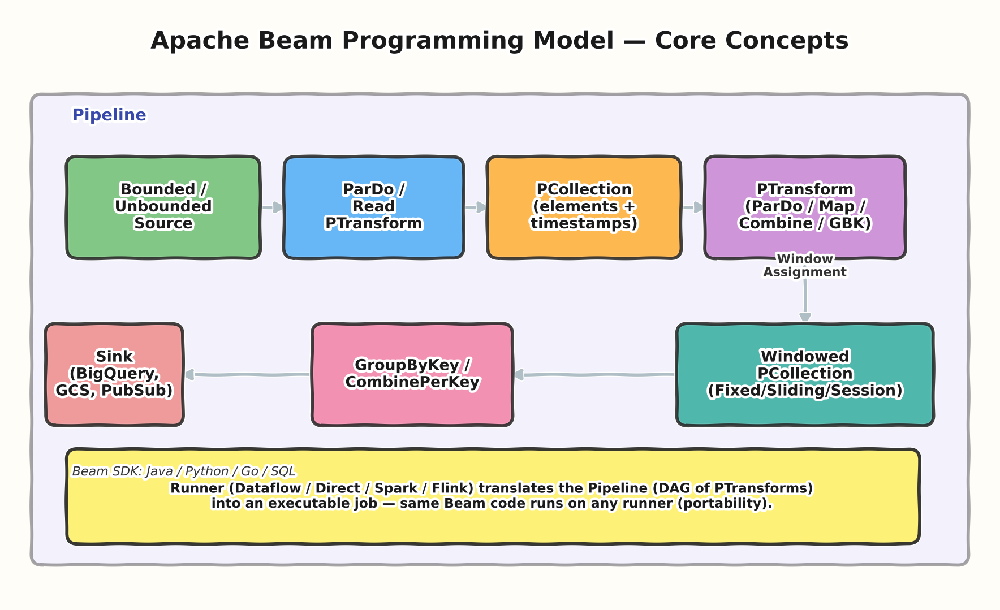
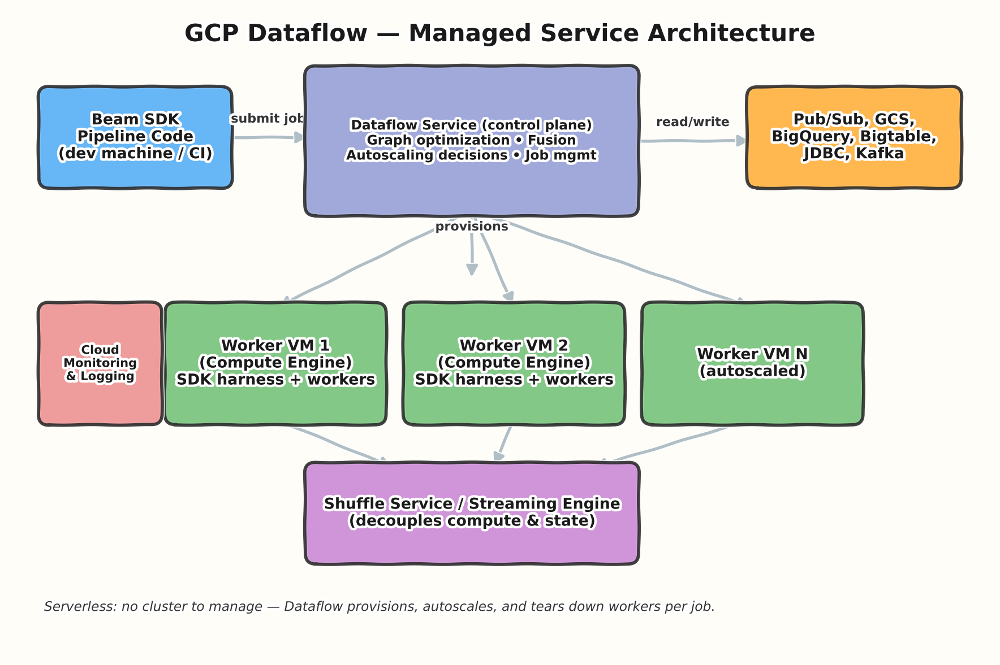
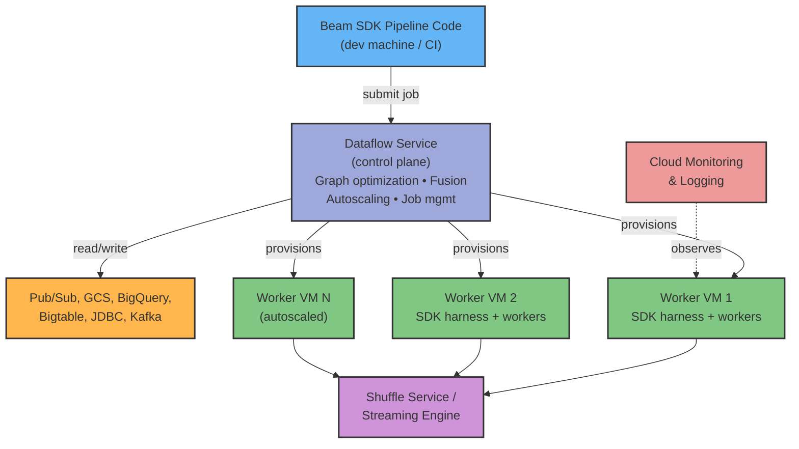

# 01 — Dataflow Fundamentals & Beam Programming Model

> **Level:** Beginner → Architect
> **Prereqs:** None — this is the foundation every other topic builds on.

## 1. What problem does Dataflow actually solve?

Google Cloud Dataflow is a **fully managed, serverless execution service**
for data processing pipelines written against the **Apache Beam** SDK. The
core value proposition, stated the way an architect should be able to state
it in an interview:

- **Unified batch + streaming model.** You write one pipeline definition;
  the same semantics apply whether the source is bounded (a GCS file, a
  BigQuery table) or unbounded (Pub/Sub, Kafka). You don't maintain two
  codebases for "the batch job" and "the real-time job."
- **No cluster management.** Dataflow provisions Compute Engine workers,
  autoscales them up/down based on backlog and CPU utilization, and tears
  them down when the job finishes. Contrast with Dataproc/self-managed
  Spark or Flink, where you own cluster sizing, patching, and idle cost.
- **Portability.** Beam is an abstraction layer with multiple **runners**
  (Dataflow, Flink, Spark, DirectRunner for local testing). The pipeline
  code itself is runner-agnostic — this is a deliberate design decision to
  avoid vendor lock-in at the programming-model layer, even though Dataflow
  the *service* is GCP-specific.
- **Dynamic work rebalancing & exactly-once semantics.** Dataflow handles
  the genuinely hard distributed-systems problems (stragglers, worker
  failures, duplicate delivery) so pipeline authors mostly don't have to.

## 2. Apache Beam programming model

Four ideas form the entire mental model. Get architect-level fluency here
before moving to windowing.

### 2.1 Pipeline
The top-level container — a **DAG (directed acyclic graph)** of
transforms. You build it, apply transforms to it, then hand it to a
**Runner** to execute.

```python
import apache_beam as beam

with beam.Pipeline() as pipeline:
    (
        pipeline
        | "ReadFromGCS" >> beam.io.ReadFromText("gs://bucket/input/*.csv")
        | "ParseRow" >> beam.Map(parse_csv_row)
        | "FilterValid" >> beam.Filter(lambda row: row["amount"] > 0)
        | "WriteToBQ" >> beam.io.WriteToBigQuery(
              "project:dataset.table",
              write_disposition=beam.io.BigQueryDisposition.WRITE_APPEND)
    )
```

### 2.2 PCollection
An **immutable, distributed dataset** — the thing flowing between
transforms. Key properties architects get asked about:

- **Immutable**: a transform never mutates its input PCollection; it
  produces a new one.
- **No inherent ordering** across elements (this trips people up coming
  from batch/SQL backgrounds — don't assume row order survives a shuffle).
- **Every element has a timestamp** (event time), which is what windowing
  operates on (see Topic 02).
- Can be **bounded** (fixed size, e.g., a file) or **unbounded** (a stream,
  e.g., Pub/Sub) — Beam treats both through the same API.

### 2.3 PTransform
An operation that takes PCollection(s) in and produces PCollection(s) out.
The primitives you must know cold:

| Transform | What it does | Interview-relevant nuance |
|---|---|---|
| `ParDo` | Element-wise processing (the "workhorse" — like `map`/`flatMap`) via a `DoFn` | Can emit 0, 1, or many outputs per input; supports side inputs/outputs |
| `GroupByKey` | Groups values by key within a window | Forces a **shuffle**; expensive; only valid on `KV` PCollections |
| `CombinePerKey` | Associative/commutative aggregation per key | Prefer over `GroupByKey` + manual reduce — supports **combiner lifting** (partial pre-aggregation before shuffle), far less data movement |
| `Flatten` | Merges multiple PCollections of the same type into one | Union, not join |
| `Partition` | Splits one PCollection into N based on a function | Opposite of Flatten |
| `CoGroupByKey` | Joins multiple PCollections by key | The Beam way to do a join |
| `Combine.globally` | Aggregation across the whole PCollection | Needs a window if unbounded |

### 2.4 Runner
Translates the pipeline DAG into an executable job on a specific execution
engine. `DirectRunner` (local, in-process) for dev/test;
`DataflowRunner` for production on GCP. The **same pipeline code** — this
is the portability guarantee Beam gives you, and it's a legitimate answer
to "why build on Beam vs. writing directly against Dataflow's API" (there
isn't a separate Dataflow-native API — Beam *is* the programming model).

### Diagram — the Beam model end to end

```mermaid
flowchart LR
    subgraph Pipeline["Pipeline (DAG)"]
        direction LR
        SRC["Source\n(Bounded/Unbounded)"] --> RD["Read PTransform"]
        RD --> PC1["PCollection\n(elements + timestamps)"]
        PC1 --> PT["PTransform\nParDo / Map / Combine / GBK"]
        PT -->|Window Assignment| WPC["Windowed PCollection\nFixed / Sliding / Session"]
        WPC --> GBK["GroupByKey / CombinePerKey"]
        GBK --> SINK["Sink\nBigQuery / GCS / Pub/Sub"]
    end
    style SRC fill:#81C784,stroke:#333,stroke-width:2px
    style RD fill:#64B5F6,stroke:#333,stroke-width:2px
    style PC1 fill:#FFB74D,stroke:#333,stroke-width:2px
    style PT fill:#CE93D8,stroke:#333,stroke-width:2px
    style WPC fill:#4DB6AC,stroke:#333,stroke-width:2px
    style GBK fill:#F48FB1,stroke:#333,stroke-width:2px
    style SINK fill:#EF9A9A,stroke:#333,stroke-width:2px
```





## 3. How Dataflow executes a job (service architecture)

When you submit a pipeline with `DataflowRunner`, here's what actually
happens — architect interviews probe this because it explains cost,
latency, and failure modes.

1. **Submission & graph optimization.** The Dataflow *service* (control
   plane) receives the pipeline graph, applies optimizations — most
   importantly **fusion**, where chains of ParDo-like operations that don't
   require a shuffle are collapsed into a single fused stage that runs
   in one worker process, avoiding unnecessary serialization/network hops.
2. **Provisioning.** Dataflow provisions Compute Engine VMs (workers) in
   your project. You don't create or manage this cluster; you set
   parameters (`--max_num_workers`, machine type, etc.) and the service
   handles the rest.
3. **Execution.** Each worker runs an **SDK harness** (the Beam runtime for
   your chosen language — this is where portability via the **Runner API /
   Fn API** and Docker-based execution comes in for cross-language
   pipelines) plus the actual work.
4. **Shuffle.** For streaming/GBK-heavy jobs, Dataflow can offload shuffle
   to a **dedicated Shuffle service** (batch) or **Streaming Engine**
   (streaming) — this decouples compute from state/shuffle storage, which
   is *why* Dataflow can autoscale workers aggressively without
   re-partitioning huge amounts of local disk state. This is a strong
   differentiator vs. self-managed Spark, where shuffle is tied to
   executor-local disk.
5. **Autoscaling.** The service watches backlog (for streaming) or
   throughput (for batch) and adds/removes workers dynamically.
6. **Teardown.** On completion (batch) or on drain/cancel (streaming),
   workers are released. You pay only for what ran.





## 4. Fusion, in more depth (common interview trap)

Fusion collapses producer-consumer transform chains into a single stage
when there's no shuffle boundary between them. This matters because:

- **Fused stages share fate** — if you're debugging why a "step" doesn't
  show separate throughput metrics in the Dataflow UI, it's often fused
  with its neighbor.
- **Fusion can hurt parallelism** in edge cases: a fused chain with an
  expensive `ParDo` after a cheap `ParDo` still runs at the parallelism of
  the *fused stage's input*, which can bottleneck. The classic fix is
  inserting a `Reshuffle()` (or a `GroupByKey`/redistribute) to force a
  fusion break and re-parallelize.
- This is a legitimate, common performance-tuning lever — expect it in
  advanced interviews as "how would you fix a pipeline where one step is
  slow but Dataflow won't scale it independently."

## 5. Interview Q&A

### Beginner

**Q: What's the difference between a PCollection and a regular list/array?**
A PCollection is an abstract, distributed, immutable representation of a
dataset — it doesn't necessarily fit in memory on one machine, has no
guaranteed element order, and every element carries an event-time
timestamp. It's a description of data flowing through the pipeline, not a
concrete in-memory structure.

**Q: What SDKs does Beam support?**
Java, Python, Go natively; Beam SQL for a SQL-based authoring experience;
and cross-language transforms via the Runner/Fn API let you mix, e.g., a
Java IO connector inside a Python pipeline.

**Q: Is Dataflow the same as Apache Beam?**
No. Beam is the open-source programming model/SDK. Dataflow is one
specific (fully managed, GCP-native) **runner** that executes Beam
pipelines. You could take the same Beam code and run it on Flink or Spark
via their respective runners.

### Intermediate

**Q: When would you use `Combine.perKey` instead of `GroupByKey` +
manual aggregation?**
Whenever the aggregation is associative/commutative (sum, count, max,
approximate distinct, etc.). `CombinePerKey` allows **combiner lifting** —
partial combination happens on each worker *before* the shuffle, so far
less data crosses the network. `GroupByKey` followed by a manual reduce
forces every value to shuffle first. This is a textbook Dataflow
performance-tuning answer.

**Q: What is a `DoFn` lifecycle, and why does it matter?**
`DoFn` has `setup()`, `startBundle()`, `processElement()`,
`finishBundle()`, `teardown()`. It matters because expensive resource
initialization (DB connections, ML model loading) belongs in `setup()`
(once per worker instance), not `processElement()` (once per element) —
a very common junior mistake that tanks throughput.

**Q: How does Beam guarantee exactly-once processing given at-least-once
delivery from sources like Pub/Sub?**
Dataflow uses deterministic, idempotent processing plus internal
checkpointing/dedup keyed by record IDs, combined with the Shuffle/
Streaming Engine's exactly-once state commits. As the pipeline author, you
mostly get this for free *inside* Dataflow, but exactly-once end-to-end
still depends on your **sinks** being idempotent (e.g., BigQuery insertId
dedup, or upserts keyed by a natural key) — Dataflow can't guarantee
exactly-once all the way to a non-idempotent external side effect.

### Advanced / Architect

**Q: Design review — a candidate says "Dataflow gives exactly-once so I
don't need idempotent writes downstream." How do you respond?**
Push back. Dataflow's exactly-once guarantee covers processing *within*
the pipeline (state, shuffle, retries). But if a `DoFn` has an external
side effect — an HTTP call, a write to a non-transactional system — that
side effect can still be executed more than once on retry, because
Dataflow retries at the *bundle* level, not per network call. The correct
architecture is: internal exactly-once + idempotent/deduplicated external
writes (natural keys, upserts, insertId-based dedup for BigQuery
streaming inserts, etc.).

**Q: Why might you deliberately break fusion, and what's the cost of doing
so?**
To force re-parallelization after a narrow/cheap stage feeds a
wide/expensive one, or to get separate, debuggable per-stage metrics in
the Dataflow UI. The cost is an extra shuffle/`Reshuffle()` — network and
serialization overhead — so it's a deliberate trade of some throughput
cost for better parallel scaling or observability; you don't do it
reflexively.

**Q: How would you explain, to a platform-cost stakeholder, why Dataflow
can cost more per-job than a static Dataproc/Spark cluster, but still be
the right choice?**
Dataproc requires you to size a cluster for peak load and often leave it
running (or manage complex autoscaling policies yourself) across many
jobs; idle capacity is wasted spend, and operational toil (patching,
sizing, tuning YARN/Spark configs) is a real, if hidden, cost. Dataflow's
serverless, per-job autoscaling means you pay closer to actual usage and
avoid the platform-engineering headcount needed to run a shared cluster
well. The trade-off is: for extremely high, sustained, predictable
throughput with tightly tuned custom Spark jobs, a well-run persistent
cluster *can* be cheaper per-byte — this is a legitimate "it depends"
answer, and a good architect says so rather than pretending Dataflow is
strictly cheaper.

## 6. Common pitfalls (quick reference)

- Doing expensive setup (model loading, DB clients) inside
  `processElement()` instead of `setup()`.
- Assuming PCollection order is preserved across a `GroupByKey`/shuffle.
- Forgetting that a fused stage's metrics won't appear as separate steps
  in monitoring.
- Treating "exactly-once" as covering external, non-idempotent side
  effects — it doesn't, automatically.
- Using `GroupByKey` + manual reduce where `CombinePerKey` would trigger
  combiner lifting and save a large amount of shuffle I/O.

---
**Next:** [02 — Windowing & Triggers](../02-windowing-triggers/README.md)
