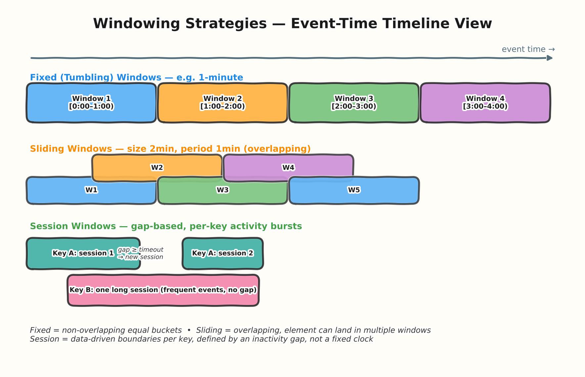
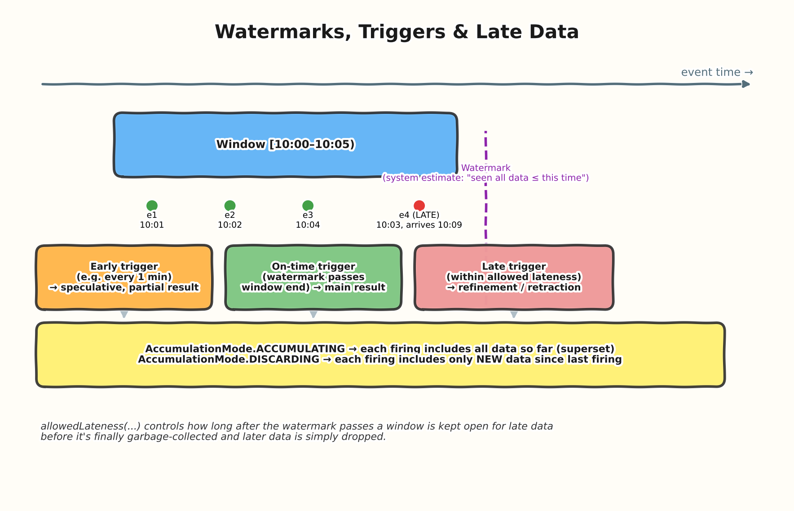
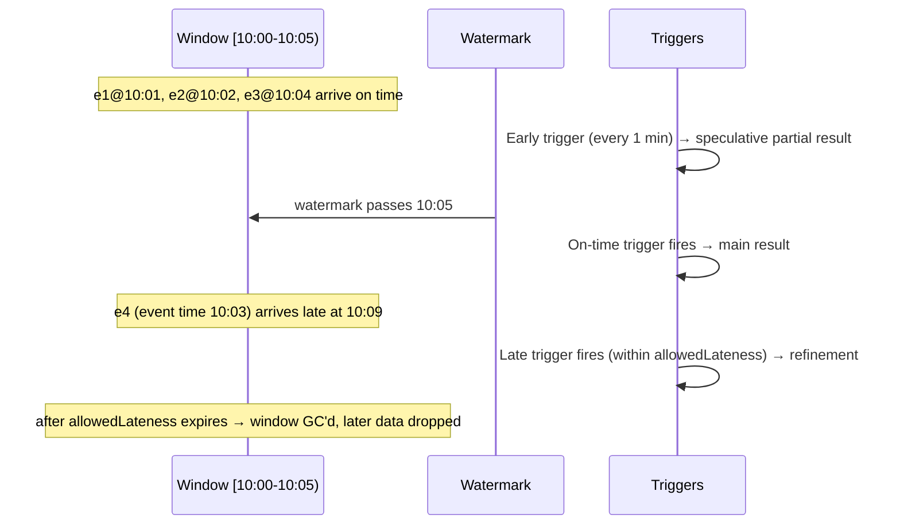

# 02 — Windowing & Triggers

> **Level:** Beginner → Architect
> **Prereqs:** [01 — Fundamentals & Beam Programming Model](../01-fundamentals/README.md)

## 1. Why windowing exists at all

An unbounded PCollection (a stream) never "ends," so aggregations like
`GroupByKey` or `Combine.globally` need a way to bound *which* elements
get aggregated together. Windowing answers: **"group elements by
event-time range."** This is the single most interview-tested Dataflow
concept because it's where genuine distributed-systems trade-offs live —
correctness vs. latency vs. cost.

Two clocks matter, and conflating them is the #1 beginner mistake:

- **Event time** — when the event actually happened (a timestamp *in* the
  data, e.g., a mobile app click timestamp).
- **Processing time** — when Dataflow actually processes the element (wall
  clock time on the worker).

Networks are unreliable, mobile clients batch/retry, upstream systems
buffer — so event time and processing time diverge, sometimes by seconds,
sometimes by hours. Windowing is defined on **event time** by default,
which is what makes correctness possible even when data arrives out of
order.

## 2. The three window types

```mermaid
flowchart TB
    subgraph Fixed["Fixed / Tumbling Windows"]
        F1["[0:00-1:00)"] --- F2["[1:00-2:00)"] --- F3["[2:00-3:00)"]
    end
    subgraph Sliding["Sliding Windows (size 2, period 1)"]
        S1["W1"] -.overlaps.- S2["W2"] -.overlaps.- S3["W3"]
    end
    subgraph Session["Session Windows (gap-based, per key)"]
        K1["Key A: session 1"] -->|gap ≥ timeout| K2["Key A: session 2"]
    end
    style F1 fill:#64B5F6,stroke:#333,stroke-width:2px
    style F2 fill:#FFB74D,stroke:#333,stroke-width:2px
    style F3 fill:#81C784,stroke:#333,stroke-width:2px
    style S1 fill:#64B5F6,stroke:#333,stroke-width:2px
    style S2 fill:#FFB74D,stroke:#333,stroke-width:2px
    style S3 fill:#81C784,stroke:#333,stroke-width:2px
    style K1 fill:#4DB6AC,stroke:#333,stroke-width:2px
    style K2 fill:#4DB6AC,stroke:#333,stroke-width:2px
```





### Fixed (Tumbling) windows
Non-overlapping, equal-size buckets (`[0,1min)`, `[1,2min)`, ...). Every
element belongs to exactly one window. Use for regular reporting
intervals — "events per minute," hourly rollups.

```python
import apache_beam as beam
from apache_beam import window

fixed = (
    pcoll
    | "FixedWindow" >> beam.WindowInto(window.FixedWindows(60))  # seconds
)
```

### Sliding windows
Overlapping windows of fixed size, emitted every `period`. An element can
land in **multiple** windows simultaneously. Use for rolling metrics —
"trailing 5-minute average, updated every 1 minute."

```python
sliding = (
    pcoll
    | "SlidingWindow" >> beam.WindowInto(window.SlidingWindows(size=300, period=60))
)
```

### Session windows
Per-key, data-driven boundaries defined by a **gap timeout**, not a fixed
clock. A new event within the gap extends the current session; a gap
larger than the timeout starts a new one. Use for user-activity sessions,
IoT device bursts.

```python
sessions = (
    pcoll
    | "SessionWindow" >> beam.WindowInto(window.Sessions(gap_size=600))
)
```

**Architect-level nuance:** session windows are **per key** — the window
boundaries themselves are computed independently for each key, which is
why `WindowInto` for sessions is normally followed by a keyed operation
(`GroupByKey`/`CombinePerKey`), and why session windowing is inherently
more state-heavy than fixed/sliding (each active key needs its own
open-session bookkeeping).

## 3. Watermarks

A **watermark** is the runner's estimate of event time progress: "I
believe I've now seen all data with event-time ≤ T." It's a heuristic, not
a guarantee — built from source-specific signals (e.g., Pub/Sub publish
time tracking, Kafka partition offsets/lag) plus configurable heuristics
for out-of-orderness.

- When the watermark **passes the end of a window**, that window is
  considered "complete enough" and its default trigger fires.
- The watermark is fundamentally a **latency vs. completeness trade-off
  knob**: a conservative (slow-moving) watermark waits longer, includes
  more late-arriving data in the "on time" result, but adds latency. An
  aggressive watermark gets you faster results but risks emitting before
  slow data arrives — which is exactly what late data handling exists for.

## 4. Triggers

Triggers decide **when** a window emits its (possibly partial) results.
Beam's default is `AfterWatermark.pastEndOfWindow()` — fire once, when the
watermark passes the window end. But you can compose richer trigger
policies:





```python
from apache_beam.transforms.trigger import (
    AfterWatermark, AfterProcessingTime, AfterCount, Repeatedly, AccumulationMode
)

pcoll_windowed = pcoll | "Window" >> beam.WindowInto(
    window.FixedWindows(300),
    trigger=AfterWatermark(
        early=AfterProcessingTime(60),      # speculative firing every 60s before watermark
        late=AfterCount(1),                 # fire again on each late record
    ),
    accumulation_mode=AccumulationMode.ACCUMULATING,
    allowed_lateness=3600,                  # keep window open 1hr past watermark for late data
)
```

### Accumulation mode — the other trap
- **ACCUMULATING**: each firing contains the full aggregate over all data
  seen so far for that window (a superset of the previous firing). Sinks
  that can overwrite/replace by key (e.g., BigQuery via a materialized
  view refresh, or a key-value store) pair naturally with this.
- **DISCARDING**: each firing contains only the delta since the last
  firing. Pairs naturally with sinks that should just append (e.g.,
  writing incremental counts to a log).

Picking the wrong mode is a very common production bug: teams using
DISCARDING mode while writing to a sink that expects a full snapshot end
up silently under-reporting totals.

## 5. Allowed lateness & window garbage collection

`allowedLateness` bounds how long, past the point the watermark passes a
window's end, the runner keeps that window's state around to accept late
data and re-fire. After it elapses, the window's state is **garbage
collected** — any further late data for that window is dropped (visible
as a `droppedDueToLateness` (or similar) metric, not a silent failure, but
easy to miss if you're not watching for it).

This is a direct **cost vs. correctness knob**: longer allowed lateness =
more accurate results in the face of very late data, but more state held
per window, which costs memory/storage on workers (especially painful
with high-cardinality keys and session windows).

## 6. Interview Q&A

### Beginner

**Q: What's the difference between event time and processing time?**
Event time is when something happened in the real world (a timestamp
carried in the data). Processing time is when Dataflow's worker actually
handles that element. They diverge due to network delay, buffering,
retries — windowing is done on event time so results are correct
regardless of processing delays.

**Q: What happens to an element that arrives after its window's watermark
has passed?**
It's "late data." If it arrives within `allowedLateness`, it triggers a
late firing (a refinement of the result). If it arrives after
`allowedLateness` has expired, the window's state is already gone and the
element is dropped.

### Intermediate

**Q: When would you choose session windows over fixed windows?**
When the meaningful grouping boundary is defined by user/device behavior
(a burst of activity) rather than by the clock — e.g., "group all clicks
in one browsing session," where a session's length varies per user and is
defined by a gap of inactivity, not a fixed 5-minute bucket that would
arbitrarily split or merge real sessions.

**Q: Why might a pipeline configured with a default trigger feel "laggy"
in a dashboard?**
Because the default trigger only fires once the watermark passes the
window end — so if window size is 1 hour, you wait up to an hour (plus
watermark lag) before seeing any result for that window. Adding an early/
speculative trigger (e.g., fire every 30s with partial data) trades some
result accuracy/completeness for much lower latency to first result.

### Advanced / Architect

**Q: A stakeholder wants "real-time" dashboards but also wants numbers
that never change once shown. How do you reconcile that with
windowing/triggers?**
Those two requirements are in direct tension — real-time necessarily means
early/speculative results that can later be **retracted or corrected**
when late data arrives (in ACCUMULATING mode, superseded by a later,
larger firing). The honest architectural answer: pick one primary
guarantee and design the UI around it — either (a) show a clearly marked
"live, may still update" number that gets corrected as later firings
arrive, with the UI diffing/replacing, or (b) show only the finalized,
post-`allowedLateness` number and accept the resulting latency. Trying to
promise both "instant" and "immutable" for the same number is not
achievable given the physics of distributed, out-of-order data arrival.

**Q: How do you reason about the cost of a very generous `allowedLateness`
on a high-cardinality streaming job (e.g., session windows keyed by
user ID, millions of users)?**
Every open window holds runner-managed state (buffered elements or
partial aggregates, trigger firing history) in the Streaming Engine/state
backend. A generous `allowedLateness` combined with high cardinality means
many more windows stay "open" simultaneously, which is directly a state-
storage and, in some pricing models, cost driver. The mitigation options
worth naming in an interview: (1) tighten `allowedLateness` to the
smallest value the business actually needs, informed by measuring real
late-data distribution; (2) use `Combine` (partial/mergeable aggregates)
instead of buffering raw elements so late-window state stays compact
regardless of how many elements arrived; (3) consider whether truly
strict correctness is needed for 100% of keys, or whether a smaller
allowed lateness with an accepted (and measured) small drop rate is an
acceptable business trade-off.

**Q: Walk through what happens end-to-end for a fixed 5-minute window
with an early trigger every minute, on-time default trigger, and a late
trigger on every late element, in ACCUMULATING mode.**
Minutes 1–4: early triggers fire with growing partial aggregates (each
a superset of the last, since ACCUMULATING). At minute 5, once the
watermark passes the window's end, the on-time trigger fires with what's
considered the "complete" result. If a late element then arrives (event
time inside the window, but arriving after the watermark passed), the
late trigger fires immediately with an updated, still-larger aggregate
that includes it — this keeps happening per late element until
`allowedLateness` expires, after which the window is GC'd and any further
late data for it is silently dropped (visible only via lateness-related
system metrics).

## 7. Common pitfalls (quick reference)

- Using DISCARDING accumulation mode while writing to a sink that expects
  a full/complete snapshot per firing.
- Assuming the default trigger gives low-latency results — it doesn't,
  without an early trigger.
- Setting `allowedLateness` far larger than actually needed "just to be
  safe," without accounting for the state-storage cost at scale.
- Forgetting that session windows are per-key, and that this makes them
  meaningfully more state-heavy than fixed/sliding windows.
- Confusing event time with processing time when debugging "why did this
  window's result change after I already saw it."

---
**Previous:** [01 — Fundamentals & Beam Programming Model](../01-fundamentals/README.md)
**Next:** 03 — Runners & Execution Model *(coming in the next batch)*
