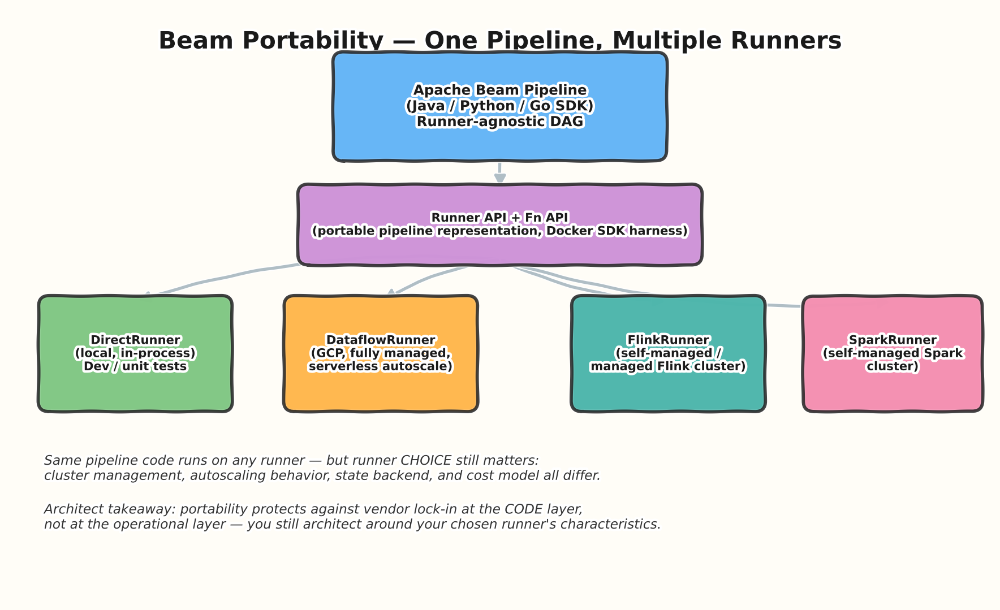
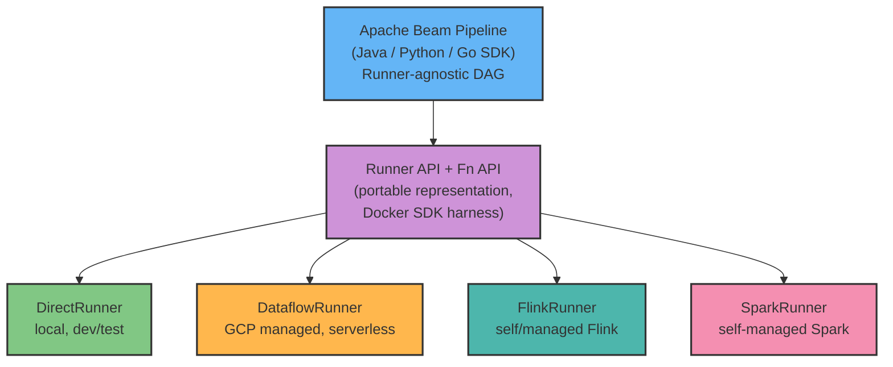
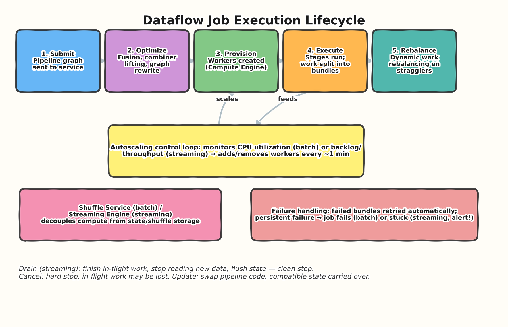
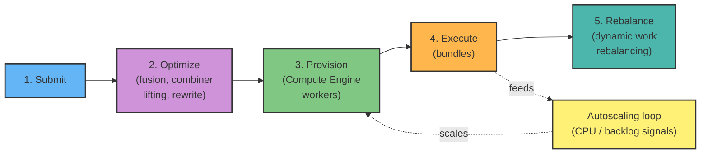

# 03 — Runners & Execution Model

> **Level:** Intermediate → Architect
> **Prereqs:** [01 — Fundamentals](../01-fundamentals/README.md), [02 — Windowing & Triggers](../02-windowing-triggers/README.md)

## 1. What a Runner actually is

A Runner is the piece of software that takes a Beam pipeline's abstract DAG
and turns it into an executable job on a specific execution engine. This
topic goes one level deeper than Topic 01's overview: how portability is
actually implemented, and what really happens inside Dataflow's execution
engine — because architect interviews probe *why* Dataflow behaves the way
it does under load, not just that it does.

### How portability is actually implemented
- **Runner API**: a language- and runner-neutral protobuf representation of
  the pipeline graph (transforms, PCollections, coders, windowing
  strategies). Any SDK can produce it; any runner can consume it.
- **Fn API**: defines how a runner's harness process communicates with
  SDK-specific worker code, typically over gRPC, often inside a Docker
  container per SDK. This is what makes **cross-language pipelines**
  possible — e.g., a Python pipeline invoking a Java-only IO connector via
  the `SDK harness` boundary.
- **Architect framing**: portability is a *code-layer* guarantee. It does
  not mean operational equivalence — a job that autoscales beautifully on
  Dataflow can behave very differently on a self-managed Flink cluster
  with fixed parallelism, because the runners implement fundamentally
  different scheduling, state-backend, and scaling models.

## 2. The Dataflow execution lifecycle, in detail

### 2.1 Work is split into bundles, not individual elements
A `DoFn` processes elements in **bundles** — batches of elements grouped
for efficiency, with the bundle as the atomic unit of retry. If any
element in a bundle fails, Dataflow can retry the whole bundle. This is
*why* `DoFn` code should be idempotent — a retried bundle may
re-process elements that already succeeded once.

### 2.2 Dynamic work rebalancing
Dataflow can **split an in-progress bundle** and hand part of the
remaining work to a different, idle worker — this is how Dataflow deals
with "straggler" tasks that would otherwise dominate a batch job's total
runtime. This is materially different from static task-splitting
approaches (e.g., naive fixed-partition MapReduce), and is a fair
interview differentiator vs. simpler batch engines.

### 2.3 Streaming Engine vs. Shuffle Service
- **Shuffle Service** (batch jobs): offloads the shuffle phase of
  `GroupByKey`-style operations to a separate, dedicated backend rather
  than spilling to worker-local disk — this is what allows Dataflow to
  aggressively resize the worker pool mid-job without re-partitioning
  massive amounts of local state.
- **Streaming Engine** (streaming jobs): moves state and shuffle
  management off the worker VMs into the service backend — allows workers
  to be smaller/cheaper (less local disk/memory needed for state) and
  supports faster, more granular autoscaling. This is a big architectural
  differentiator vs. self-managed Flink/Spark Streaming, where state
  typically lives with the compute (RocksDB on local disk, e.g.).

### 2.4 Autoscaling signals
- **Batch**: primarily driven by CPU utilization and estimated remaining
  work.
- **Streaming**: primarily driven by **backlog** (how much unprocessed
  data is queued upstream, e.g., Pub/Sub subscription backlog) and per-
  stage throughput.
- Autoscaling decisions happen on a roughly ~1 minute cadence — not
  instantaneous — which matters when explaining why a sudden traffic
  spike causes a few minutes of elevated latency before the pipeline
  catches up.

### 2.5 Job lifecycle operations — architect-critical distinctions

| Operation | What happens | When to use |
|---|---|---|
| **Cancel** | Hard stop; in-flight work and buffered state may be lost | Emergency stop, non-critical job |
| **Drain** | Stops ingesting new data, finishes in-flight work, flushes state to sinks, then stops cleanly | Planned shutdown of a streaming job with no data loss |
| **Update** | Swaps in new pipeline code on a running streaming job, carrying over compatible state | Rolling out a bug fix/feature to a live streaming pipeline without reprocessing from scratch |

**Update compatibility is a real interview trap**: an update is only
allowed if the new pipeline's graph structure is compatible with the old
one (transform names/IDs, state shape). Renaming steps, changing windowing
strategy, or altering stateful `DoFn` state types can break update
compatibility, forcing a drain + fresh start instead — which is a
meaningful operational/architectural consideration when planning
production streaming pipeline changes.

## 3. Interview Q&A

### Beginner

**Q: What's the difference between `DirectRunner` and `DataflowRunner`?**
`DirectRunner` executes the pipeline locally, in-process — useful for
development and unit testing, not for production scale. `DataflowRunner`
submits the pipeline to the managed Dataflow service on GCP, which
provisions and autoscales real distributed workers.

**Q: Can you run the same Beam pipeline code on Spark instead of
Dataflow?**
Yes, provided the pipeline doesn't use Dataflow-specific extensions —
just swap the runner (`SparkRunner`), and, in practice, verify that any
IO connectors/features used are supported by that runner too (not all
Beam features have equal support across every runner).

### Intermediate

**Q: Why does Dataflow retry at the bundle level instead of the individual
element level?**
Bundling amortizes per-element overhead (fewer round trips, more
efficient batching of I/O), but it means a transient failure on one
element can trigger reprocessing of everything else in that bundle. This
is precisely why idempotent processing (see Topic 01, exactly-once
discussion) matters even for internal Dataflow retries, not just external
sink writes.

**Q: What's the practical difference in behavior between a batch job with
Shuffle Service enabled vs. disabled?**
With Shuffle Service, shuffle data moves off worker-local disk into a
dedicated backend — workers can be resized (added/removed) mid-shuffle
without needing to re-partition local spill files, and very large shuffles
aren't bottlenecked by individual worker disk I/O. Without it (the
default in some configurations/regions historically), shuffle uses
worker-local disk, which behaves more like traditional Spark shuffle —
less elastic, more disk-bound.

### Advanced / Architect

**Q: A streaming pipeline needs a schema change to its stateful DoFn.
How do you plan the rollout?**
First, determine whether the change preserves state compatibility —
i.e., whether `Update` is viable. If the state shape changes
incompatibly, `Update` will be rejected, and the safe path is: drain the
existing job (ensuring buffered/in-flight data and state cleanly flush to
sinks), then start a new job with the new code. Communicate the
consequence up front: draining means a short processing gap (unless you
run the new job in parallel against a replay-capable source, e.g., a
Pub/Sub subscription with retained messages, and cut over once caught
up) — an architect should present this trade-off explicitly rather than
letting stakeholders discover an outage during a routine deploy.

**Q: Explain why Dataflow's autoscaling isn't instantaneous, and how you'd
architect around that limitation for a bursty workload.**
Autoscaling evaluates backlog/CPU signals on a roughly minute-scale
cadence and then takes time to provision new Compute Engine workers — so
there's an inherent few-minutes lag between a load spike and full
capacity coming online. For genuinely bursty, latency-sensitive
workloads, mitigations include: over-provisioning a higher
`--min_num_workers` floor if cost allows, decoupling ingestion from
processing with a buffering layer (Pub/Sub naturally does this — messages
queue rather than being dropped while the pipeline catches up), and
setting SLOs that account for a few minutes of elevated latency during
genuine traffic spikes rather than promising sub-second worst-case
latency unconditionally.

**Q: How would you decide between DataflowRunner and a self-managed
FlinkRunner on GKE for a new streaming platform?**
Frame it as a build-vs-operate trade-off, not a raw performance question.
Dataflow wins on operational simplicity (no cluster/version/patch
management, native GCP IAM/VPC-SC integration, built-in autoscaling and
Streaming Engine) and is the default choice absent a specific reason
otherwise. Self-managed Flink becomes attractive when you need
capabilities Dataflow doesn't expose as cleanly — e.g., very fine-grained
control over state backends and checkpointing intervals, multi-cloud
portability as a hard requirement, or an existing organizational
investment in Flink operational expertise/tooling. A senior answer names
the concrete trigger conditions rather than declaring one universally
better.

## 4. Common pitfalls (quick reference)

- Assuming individual-element retries — bundles are the retry unit, so
  idempotency matters more broadly than people expect.
- Expecting Dataflow autoscaling to react in seconds — plan for
  minutes-scale reaction time.
- Attempting an `Update` across an incompatible graph/state change and
  being surprised when it's rejected — plan drain+restart for such
  changes.
- Treating runner portability as full operational portability — the same
  code can have very different cost/scaling/state characteristics on a
  different runner.

---
**Previous:** [02 — Windowing & Triggers](../02-windowing-triggers/README.md)
**Next:** [04 — Pipeline Design Patterns](../04-pipeline-design-patterns/README.md)
