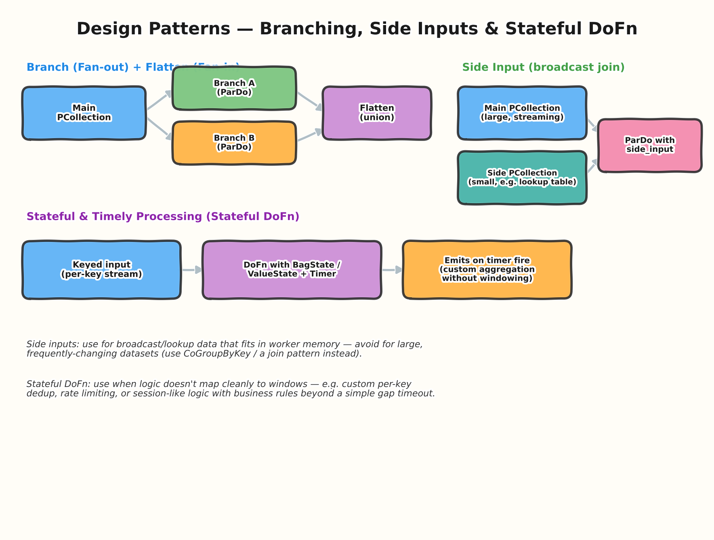
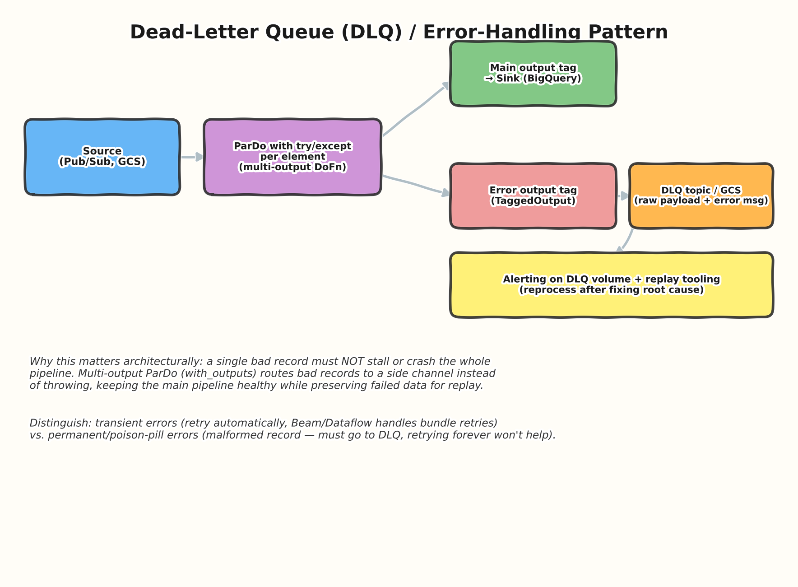
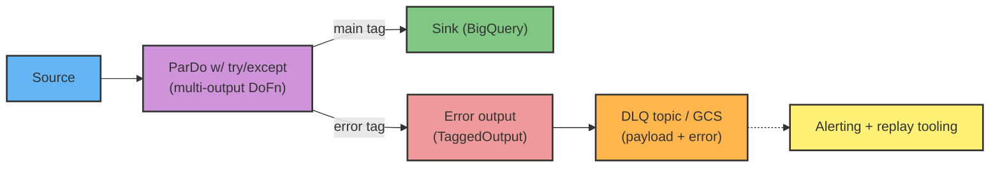

# 04 — Pipeline Design Patterns

> **Level:** Intermediate → Architect
> **Prereqs:** [01 — Fundamentals](../01-fundamentals/README.md), [02 — Windowing & Triggers](../02-windowing-triggers/README.md), [03 — Runners & Execution Model](../03-runners-execution/README.md)

This topic moves from "what the primitives are" to "how experienced
engineers actually compose them" — the patterns that separate a working
pipeline from a production-grade, maintainable one. This is a favorite
area for architect-round system-design questions because it tests
judgment, not just API recall.

## 1. Branching & fan-in (Partition / multiple ParDo + Flatten)

Apply multiple transforms to the same PCollection to get independent
branches (**fan-out**), then optionally recombine with `Flatten`
(**fan-in**, a union — not a join).



```python
raw = pipeline | "Read" >> beam.io.ReadFromPubSub(topic=TOPIC)

valid, invalid = (
    raw
    | "Validate" >> beam.ParDo(ValidateFn()).with_outputs("invalid", main="valid")
)

enriched = valid | "Enrich" >> beam.ParDo(EnrichFn())
audited  = valid | "Audit" >> beam.ParDo(AuditLogFn())   # independent branch, same input

combined = (enriched, audited) | "Flatten" >> beam.Flatten()
```

**When to use:** when the same input needs multiple independent
downstream treatments (e.g., write raw data to a data lake AND compute
real-time aggregates from the same stream) without re-reading the source.

## 2. Side inputs (broadcast join pattern)

A **side input** makes a (typically small) PCollection available, in its
entirety, to every worker processing the main PCollection — effectively a
broadcast join, avoiding a shuffle.

```python
import apache_beam as beam
from apache_beam.pvalue import AsDict

lookup_table = pipeline | "ReadLookup" >> beam.io.ReadFromBigQuery(query=LOOKUP_QUERY)
lookup_side = beam.pvalue.AsDict(lookup_table)  # materialized as a dict on each worker

enriched = (
    main_pcoll
    | "EnrichWithLookup" >> beam.Map(
        lambda elem, lookup: {**elem, "category": lookup.get(elem["id"], "unknown")},
        lookup=lookup_side,
    )
)
```

**Sizing rule of thumb (architect-relevant):** side inputs are cached
per-worker in memory (with some runner-level optimizations for access
patterns). If the "small" side dataset grows into the GBs or updates
frequently, this pattern breaks down — switch to `CoGroupByKey` (a real
join with a shuffle) or an external lookup service (Bigtable/Redis) with
appropriate caching instead.

## 3. Stateful & timely processing (Stateful DoFn)

For logic that doesn't map cleanly onto windowing — custom per-key
deduplication, rate limiting, business-rule-driven session-like behavior
— Beam exposes **user state** (`BagState`, `ValueState`, `CombiningState`)
and **timers** directly inside a `DoFn`.

```python
from apache_beam import DoFn
from apache_beam.transforms.userstate import BagStateSpec, TimerSpec, TimeDomain, on_timer
import apache_beam.coders as coders

class DedupWithinWindowFn(DoFn):
    SEEN = BagStateSpec("seen", coders.StrUtf8Coder())
    EXPIRY_TIMER = TimerSpec("expiry", TimeDomain.WATERMARK)

    def process(self, element, seen=DoFn.StateParam(SEEN), expiry=DoFn.TimerParam(EXPIRY_TIMER)):
        key, value = element
        already_seen = list(seen.read())
        if value not in already_seen:
            seen.add(value)
            expiry.set(...)  # schedule cleanup
            yield element

    @on_timer(EXPIRY_TIMER)
    def clear_state(self, seen=DoFn.StateParam(SEEN)):
        seen.clear()
```

**Architect nuance:** stateful DoFns force **per-key serialized
processing** for that key (Beam guarantees no concurrent state mutation
for the same key) — this can become a throughput bottleneck for
extremely hot keys. It's a legitimate trade-off to name in an interview:
correctness/control vs. potential hot-key throughput limits.

## 4. Dead-letter queue / error-handling pattern

Production pipelines must isolate bad records instead of letting them
crash or stall the whole job.





```python
class SafeParseFn(beam.DoFn):
    def process(self, element):
        try:
            yield beam.pvalue.TaggedOutput("main", parse(element))
        except Exception as e:
            yield beam.pvalue.TaggedOutput(
                "errors", {"raw": element, "error": str(e)}
            )

results = raw | "SafeParse" >> beam.ParDo(SafeParseFn()).with_outputs("main", "errors")
results.main   | "WriteGood" >> beam.io.WriteToBigQuery(GOOD_TABLE)
results.errors | "WriteDLQ"  >> beam.io.WriteToPubSub(DLQ_TOPIC)
```

**Interview-critical distinction:** transient errors (network blip,
temporary sink unavailability) should be retried — Dataflow/Beam already
retries at the bundle level for unhandled exceptions. Permanent/"poison
pill" errors (malformed data that will *never* parse) must NOT be
retried indefinitely — they belong in a DLQ for offline
investigation/replay. Conflating the two either causes infinite retry
loops that stall a streaming pipeline, or silently drops data that should
have been retried.

## 5. Additional patterns worth naming in interviews

- **Windowed aggregation → unbounded sink pattern**: window a stream,
  aggregate, and write results incrementally (e.g., streaming inserts to
  BigQuery) rather than trying to batch an unbounded stream into one
  final write.
- **Reshuffle for fusion-break / re-parallelization**: covered in Topic
  01 — inserting `beam.Reshuffle()` to force re-parallelization after a
  narrow stage feeds a wide one.
- **Schema-on-read validation pattern**: validate/coerce schema as early
  as possible in the pipeline (right after the source read) so downstream
  transforms can assume clean, typed data — pushes error handling to one
  well-tested boundary instead of scattering defensive checks everywhere.
- **Idempotent sink pattern**: pair with natural keys/upserts
  (BigQuery MERGE, Bigtable row keys, insertId-based dedup) so that
  Dataflow's internal at-least-once bundle retries never produce
  duplicate business-level effects.

## 6. Interview Q&A

### Beginner

**Q: What does `Flatten` do, and how is it different from a join?**
`Flatten` performs a union — it merges multiple PCollections of the
*same type* into one, with no matching/joining logic. A join
(`CoGroupByKey`) combines elements from different PCollections based on a
shared key.

**Q: Why use a side input instead of just doing a `CoGroupByKey`?**
Side inputs avoid a shuffle entirely when the side data is small enough
to broadcast to every worker — much cheaper than a full shuffle-based
join for small, relatively static reference/lookup data.

### Intermediate

**Q: When would a stateful DoFn be a better choice than session
windows for grouping related events?**
When the grouping logic involves business rules beyond a simple
inactivity gap — e.g., "group events until we see an explicit `END`
event, or until 100 events have accumulated, or until 24 hours have
passed, whichever comes first." Session windows only support a fixed gap
timeout; a stateful DoFn with a timer can implement arbitrary custom
logic.

**Q: How do you prevent a single malformed record from taking down a
streaming pipeline?**
Wrap per-element processing in a try/except inside a multi-output
`DoFn`, routing failures to a tagged "error" output rather than letting
the exception propagate and trigger bundle-level (and potentially
job-level, if persistent) retries. Route the error output to a DLQ for
investigation and replay, with alerting on DLQ volume so failures are
visible rather than silently accumulating.

### Advanced / Architect

**Q: Design a pipeline that enriches a high-volume clickstream with a
reference dataset that updates a few times per day. Walk through your
side-input vs. join decision.**
If the reference dataset is small (fits comfortably in worker memory,
say under a few hundred MB) and updates infrequently, a **side input
refreshed periodically** (e.g., a `PeriodicImpulse`-triggered re-read, or
Beam's side-input windowing to auto-refresh on a schedule) is the
simplest, cheapest option — no shuffle on the hot path. If the reference
dataset is large or updates need to be reflected with low latency, prefer
`CoGroupByKey` against a windowed version of the reference stream, or
externalize the lookup to a low-latency store (Bigtable) with client-side
caching — accepting the added operational complexity of running/managing
that store. The deciding factors to state explicitly: reference dataset
size, update frequency/staleness tolerance, and whether you're willing to
own an additional stateful system (Bigtable) versus staying entirely
within Beam's own primitives.

**Q: A stateful DoFn processing per-user session state is bottlenecked on
a handful of extremely active "power users" (hot keys). How do you
redesign around this?**
Because Beam serializes state access per key, a small number of
disproportionately active keys can dominate a worker's processing time
and cap overall throughput, regardless of how many workers are
available. Mitigations to discuss: (1) key-splitting — artificially
shard a hot key into N sub-keys (e.g., `user_id + random_shard`) to
parallelize its processing, then merge results in a later stage; (2)
reconsider whether true per-key exact-order state is actually required
for those users, or whether a slightly relaxed/approximate approach
(e.g., periodic flush instead of per-event state mutation) is acceptable;
(3) isolate known hot keys into a separately tuned pipeline/path if
they represent a small, identifiable subset with fundamentally different
throughput needs than the long tail. The interview signal here is
recognizing hot-key skew as a first-class distributed-systems problem,
not just a Beam quirk.

**Q: How do you decide where in the pipeline schema validation should
happen?**
As early as possible — immediately after the source read, before any
business logic. Centralizing validation at one boundary means every
downstream transform can assume well-typed, valid data (no defensive
null-checks scattered everywhere), and it makes the DLQ pattern trivial
to apply at exactly one place. The trade-off to acknowledge: very early
validation means you need to already know the full "valid" schema
up front — for pipelines ingesting genuinely evolving/semi-structured
data, a staged approach (permissive parse → typed validation as a
distinct, still-early stage) can be more maintainable than a single
monolithic validation step.

## 7. Common pitfalls (quick reference)

- Using a side input for a dataset that's too large or updates too
  frequently to broadcast cheaply.
- Letting unhandled exceptions in a `DoFn` propagate instead of routing
  bad records to a DLQ — risks stalling a streaming pipeline on poison-
  pill data.
- Not recognizing hot-key skew in stateful DoFns as a throughput ceiling.
- Scattering validation/defensive checks throughout the pipeline instead
  of centralizing it near the source read.
- Forgetting that `Flatten` is a union, not a join — a common naming-
  induced mistake for engineers coming from SQL.

---
**Previous:** [03 — Runners & Execution Model](../03-runners-execution/README.md)
**Next:** [05 — Streaming vs Batch Architecture](../05-streaming-vs-batch/README.md)
