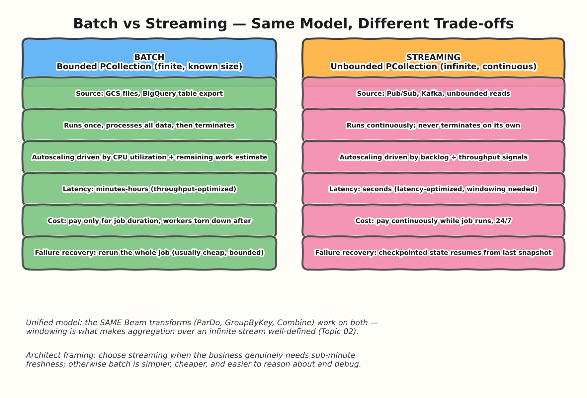
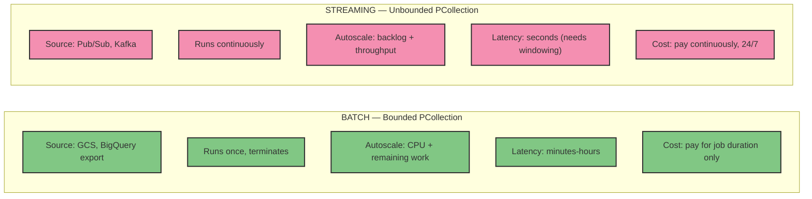
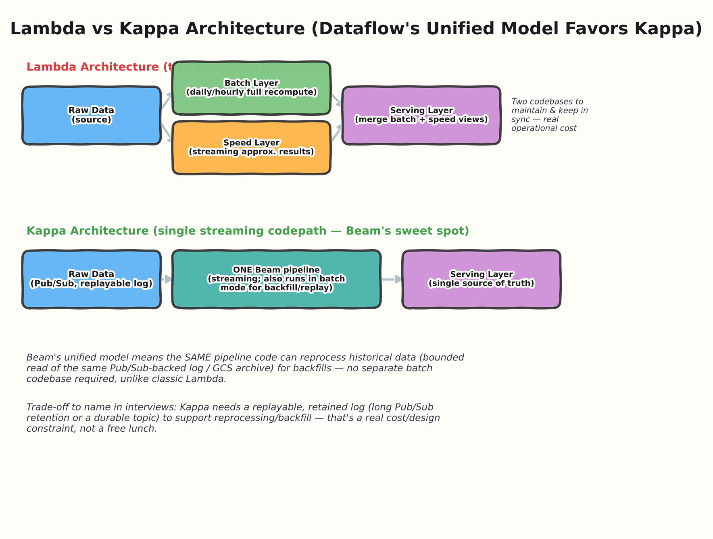
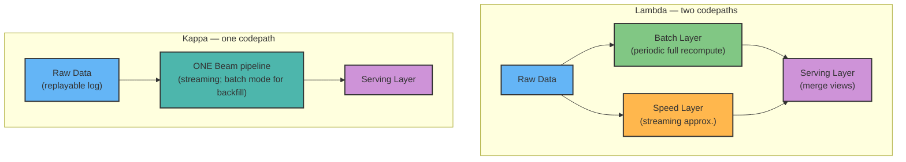

# 05 — Streaming vs Batch Architecture

> **Level:** Intermediate → Architect
> **Prereqs:** [01 — Fundamentals](../01-fundamentals/README.md), [02 — Windowing & Triggers](../02-windowing-triggers/README.md)

## 1. One model, two very different operational profiles

Beam's unified programming model means the *code* for batch and streaming
pipelines looks similar — same `ParDo`, `GroupByKey`, `Combine`. But
architecturally, batch and streaming Dataflow jobs are almost different
products, with different cost models, failure modes, and operational
demands. Interviewers at the architect level care most about whether you
can articulate *when* to choose which, not just how the API differs.

### Key architectural differences, beyond "one runs forever"

| Dimension | Batch | Streaming |
|---|---|---|
| Failure recovery | Rerun the whole (bounded) job | Resume from checkpointed state |
| Result finality | Final on completion | Provisional until watermark/lateness resolves (Topic 02) |
| Testing | Deterministic, repeatable | Must account for out-of-order arrival, timing |
| Deployment risk | Low — job just runs again | Higher — `Update`/`Drain` semantics matter (Topic 03) |
| Typical cost driver | Total data volume processed | Sustained worker-hours, 24/7 |

## 2. Lambda vs Kappa architecture

This is one of the most common "design a data platform" interview
framings, and Dataflow/Beam has a specific, defensible position on it.

- **Lambda architecture**: maintain a batch layer (accurate, complete, but
  slow) and a speed layer (fast, approximate) separately, merged at
  serving time. The historical justification was that stream processors
  couldn't be trusted for correctness — so a batch recompute was needed
  as the source of truth.
- **Kappa architecture**: treat everything as a stream; batch is just "a
  bounded read of the same log." Beam is explicitly designed to make this
  practical — the *same* pipeline code can run in streaming mode for live
  processing and in batch mode (reading a bounded slice of a retained,
  replayable log) for backfills/reprocessing.
- **Why Dataflow/Beam architects lean Kappa**: one codebase, one set of
  business logic to test and maintain, no risk of batch and speed layers
  silently drifting apart in behavior. The real cost is operational: you
  need a source that supports replay (long-retention Pub/Sub, a
  Kafka-like durable log, or archiving raw events to GCS for bounded
  re-reads) — that's a genuine design requirement, not a free upgrade.

## 3. Choosing batch vs streaming — the actual decision framework

An architect-level answer to "should this be a streaming pipeline"
walks through concrete criteria, not a gut call:

1. **What's the actual business freshness requirement?** "Real-time" is
   frequently used loosely — clarify whether the stakeholder needs
   sub-minute freshness (genuinely needs streaming) or just "not
   yesterday's data" (a well-scheduled batch job every 15-60 minutes may
   satisfy this at a fraction of the cost and complexity).
2. **What does the source actually support?** A source that's
   fundamentally a periodic export (e.g., a nightly extract from a legacy
   system) gains nothing from a streaming pipeline sitting in front of
   it — batch is the honest fit.
3. **What's the cost tolerance?** Streaming jobs run continuously —
   24/7 worker-hours — versus batch jobs that only cost money while they
   run. For low-value, infrequently-needed data, batch is usually far
   cheaper.
4. **What's the team's operational maturity for streaming?** Streaming
   pipelines carry more subtle correctness concerns (watermarks, late
   data, `Update`/`Drain` semantics) — a team without experience running
   streaming systems takes on real operational risk adopting one before
   they need to.

## 4. Interview Q&A

### Beginner

**Q: What makes a PCollection "bounded" vs "unbounded"?**
Bounded means the source has a known, finite size (a file, a table
export) — the pipeline processes it and terminates. Unbounded means the
source is continuous/indefinite (Pub/Sub, Kafka) — the pipeline runs
until explicitly stopped.

**Q: Can a batch pipeline use windowing?**
Yes — by default a batch job's entire (bounded) PCollection is treated
as one global window, but you can still apply fixed/sliding windows to a
bounded PCollection if you want time-bucketed results from historical
data (e.g., "daily totals" from a month of archived data in one batch
run).

### Intermediate

**Q: Why is failure recovery so different between batch and streaming?**
A batch job's failure recovery is simple because the whole input is
already fully known and bounded — worst case, rerun it. A streaming
job's input is infinite, so recovery must rely on periodic checkpointing
of internal state (offsets, aggregation state) so a restart can resume
roughly where it left off instead of reprocessing an unbounded amount of
history.

**Q: What's a concrete reason to prefer Kappa over Lambda for a new
platform on GCP?**
Avoiding two divergent codebases for the same business logic. In Lambda,
subtle differences between the batch recompute logic and the streaming
approximation logic are a very real, recurring source of production bugs
("why do the daily numbers not match the real-time dashboard") — Kappa,
enabled by Beam's unified model, eliminates that entire class of bug by
construction.

### Advanced / Architect

**Q: A stakeholder insists on "real-time everything" for a new
analytics platform. How do you respond as the architect?**
Push back constructively by separating "real-time" into concrete SLAs
per use case rather than accepting it as a blanket requirement. In
practice, different parts of most platforms have genuinely different
freshness needs — fraud detection might need sub-second, executive
dashboards might be fine with 15-minute freshness, and compliance
reporting might only need daily. Architecting everything for the
strictest possible latency (all-streaming) usually means paying a
continuous 24/7 cost for freshness most consumers of the data don't
actually need. The senior move is presenting a tiered design: streaming
where the SLA genuinely demands it, batch (or micro-batch) elsewhere,
justified by cost and complexity trade-offs specific to each use case.

**Q: Your organization wants to migrate from a Lambda architecture (a
legacy nightly Spark batch job plus a separate ad hoc streaming
approximation) to a Kappa architecture on Dataflow. What are the real
risks in that migration, beyond "rewrite the pipeline"?**
Name the non-obvious ones: (1) the source system may not currently
support replay/backfill — moving to Kappa requires establishing a
durable, retained event log (e.g., extending Pub/Sub retention,
archiving raw events to GCS) if one doesn't already exist; (2) the
existing batch job's logic may have accumulated undocumented
"corrections" over time that were never reflected in the streaming
approximation — reconciling these during migration, rather than blindly
picking one as ground truth, takes real analysis; (3) validation
strategy — you typically want to run the new unified pipeline in
parallel with the legacy system for a defined period, diffing outputs,
before cutting over, which itself requires the old system to keep
running (temporarily higher cost) and a clear, objective definition of
"acceptable diff" for approximate/timing-sensitive fields.

## 5. Common pitfalls (quick reference)

- Defaulting to "streaming" because it sounds more sophisticated, without
  a concrete freshness SLA driving the decision.
- Underestimating the 24/7 cost of a streaming job versus a batch job
  that only runs (and costs money) when scheduled.
- Adopting Kappa without first confirming the source system actually
  supports replay/backfill.
- Assuming Lambda and Kappa are purely technical choices — the real
  driver is almost always the cost of maintaining (or eliminating) two
  divergent business-logic codepaths.

---
**Previous:** [04 — Pipeline Design Patterns](../04-pipeline-design-patterns/README.md)
**Next:** [06 — Autoscaling & Performance Tuning](../06-autoscaling-performance/README.md)
