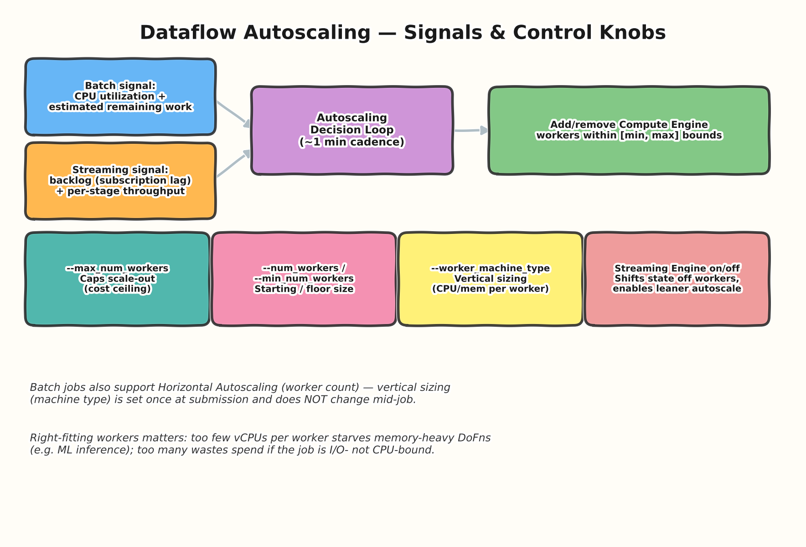
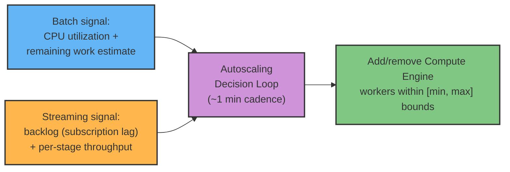
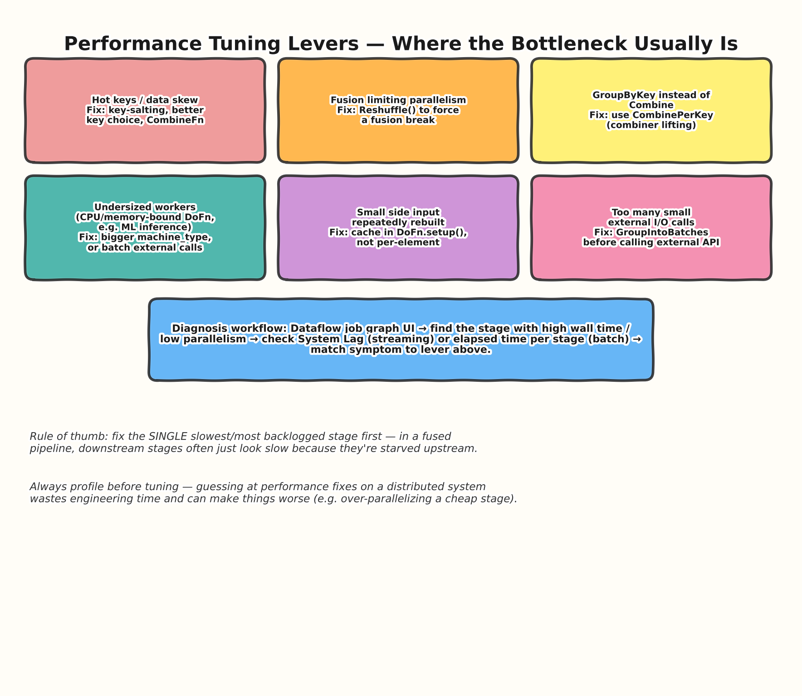
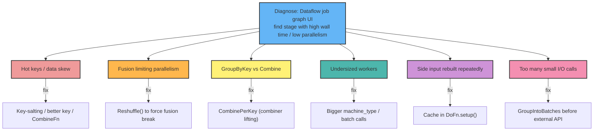

# 06 — Autoscaling & Performance Tuning

> **Level:** Intermediate → Architect
> **Prereqs:** [01 — Fundamentals](../01-fundamentals/README.md), [03 — Runners & Execution Model](../03-runners-execution/README.md)

## 1. How Dataflow's autoscaling actually decides

Covered at a high level in Topic 03; here's the control-knob-level detail
an architect is expected to know when tuning a production job.

### Control knobs and what they actually do

| Flag / setting | Effect | When to touch it |
|---|---|---|
| `--max_num_workers` | Hard ceiling on scale-out | Set as a cost control — prevents a backlog spike or bad code from scaling to an unbounded bill |
| `--num_workers` / `--min_num_workers` | Starting size / floor | Raise the floor for latency-sensitive streaming jobs to avoid the "cold scale-up" lag on traffic spikes |
| `--worker_machine_type` | Vertical sizing (vCPU/memory per worker) | Fixed at submission — does **not** change mid-job; tune for CPU- vs memory-bound `DoFn` work |
| `--disk_size_gb` / disk type | Local disk for shuffle spill (when Shuffle/Streaming Engine isn't used) | Rarely tuned directly once Shuffle Service/Streaming Engine is enabled |
| Streaming Engine (on by default in most current setups) | Moves state/shuffle off worker VMs | Enables leaner, faster-scaling workers; a genuine architectural lever, not just a flag |

**Architect-level nuance:** horizontal autoscaling (worker *count*) is
dynamic and automatic. Vertical sizing (`--worker_machine_type`) is
**static per job** — chosen at submission time and not revisited by
Dataflow mid-run. If a job is memory-starved, the fix is re-submitting
with a bigger machine type, not waiting for autoscaling to "fix" it —
autoscaling only ever adds/removes machines of the *same* type.

## 2. Where performance problems actually live

Most real-world Dataflow performance issues trace back to a small,
recognizable set of root causes. Recognizing the *symptom → cause →
fix* mapping is exactly what separates "I can write a pipeline" from
"I can operate one in production."

### 2.1 Hot keys / data skew
If one key has drastically more elements than others, the worker
processing that key becomes a serialized bottleneck (recall Topic 04's
stateful-DoFn hot-key discussion — the same issue applies to plain
`GroupByKey`/`CombinePerKey` on skewed keys). Fixes: key-salting
(sub-partition the hot key, e.g. `key + hash(value) % N`, then merge in
a second aggregation stage), reconsidering the key granularity, or using
`CombineFn` (with combiner lifting) instead of raw `GroupByKey` so at
least partial aggregation happens before the shuffle concentrates on the
hot key.

### 2.2 Fusion limiting parallelism
As covered in Topic 01: a fused chain runs at the parallelism of its
upstream input. If a cheap upstream stage feeds an expensive downstream
one, insert `beam.Reshuffle()` to force a fusion break and let the
expensive stage parallelize independently.

### 2.3 `GroupByKey` where `CombinePerKey` would do
`GroupByKey` ships every value across the shuffle boundary. `Combine`-
family transforms (`CombinePerKey`, `Combine.globally`) support
**combiner lifting**: partial aggregation happens locally on each worker
*before* the shuffle, drastically reducing data movement for
associative/commutative aggregations (sums, counts, approximate
distincts).

### 2.4 Undersized/mis-sized workers
CPU- or memory-heavy `DoFn`s (e.g., invoking an ML model, heavy
regex/parsing) can starve on an undersized `worker_machine_type`. Since
vertical sizing is static, this requires resubmission with a larger
machine type, or restructuring the work (e.g., moving expensive
inference to a batched external call instead of doing it inline
per-element).

### 2.5 Side inputs rebuilt per element
A classic beginner mistake: constructing/parsing side-input-derived data
structures inside `process()` instead of once in `setup()`. This is the
same DoFn-lifecycle lesson from Topic 01, applied specifically to side
inputs and any other "expensive, reusable" resource.

### 2.6 Chatty external I/O
Making one external API/DB call per element imposes massive per-call
overhead at scale. `GroupIntoBatches` lets you batch elements before
making a single external call per batch, trading a little latency for a
large throughput/cost improvement — very common in enrichment pipelines
calling external services.

## 3. The diagnostic workflow

1. Open the Dataflow job's execution graph in the console (or via the
   monitoring API) and look for the stage with disproportionately high
   wall-clock time or a large "input/output" element-count mismatch.
2. For streaming jobs, check **System Lag** and per-stage **backlog** —
   a stage with growing backlog is the bottleneck; downstream stages
   simply starve.
3. For batch jobs, check per-stage elapsed time and worker CPU
   utilization over the job's timeline.
4. Match the symptom to one of the levers above — resist the urge to
   tune multiple things simultaneously; change one lever, re-measure.

## 4. Interview Q&A

### Beginner

**Q: What's the difference between horizontal and vertical scaling in
Dataflow?**
Horizontal scaling changes the number of worker VMs and is fully
automatic via Dataflow's autoscaling. Vertical scaling changes the size
(vCPU/memory) of each worker VM and is set once at job submission via
`--worker_machine_type` — it does not change automatically during a run.

**Q: What does `--max_num_workers` protect against?**
An unbounded/runaway cost scenario — without a ceiling, a large backlog
spike (streaming) or a huge unexpected batch input could scale the job
out very aggressively, driving up spend. It's a deliberate cost-control
lever, at the trade-off of possibly capping throughput below what the
job could otherwise achieve.

### Intermediate

**Q: A streaming job's backlog is growing even though CPU utilization on
existing workers looks low. What's likely going on?**
This is a classic sign that the bottleneck isn't compute-bound
parallelism but something else — commonly a hot key (a few keys
dominate, so adding more workers doesn't help because the hot key's
processing is inherently serialized), or a downstream sink that's
rate-limiting/throttling writes (e.g., BigQuery streaming insert quota,
a slow external API), making more compute pointless since the
pipeline is I/O-bound elsewhere, not CPU-bound.

**Q: Why doesn't simply raising `--max_num_workers` always fix a
performance problem?**
Autoscaling only adds *more of the same*. If the actual bottleneck is a
single hot key, an unsplittable I/O bound sink, or a fused stage stuck
at low parallelism, throwing more workers at the job doesn't help — it
often just increases cost without improving throughput. Diagnosis must
identify *which* lever actually applies before scaling blindly.

### Advanced / Architect

**Q: You've inherited a Dataflow streaming job with a growing backlog
and rising cost. Walk through your diagnostic and remediation process as
the architect, not just the on-call engineer.**
First, establish whether this is a capacity problem or a structural
bottleneck — check whether `--max_num_workers` is actually being hit
(true capacity ceiling) versus backlog growing while workers sit well
under the cap (a structural bottleneck like a hot key or a rate-limited
sink). For a capacity ceiling, the fix is a cost/latency trade-off
conversation with stakeholders — raise the cap (cost) or accept the
current latency. For a structural bottleneck, walk the job graph to
isolate the specific stage, and apply the matching lever from Section 2
above. Beyond the immediate fix, an architect should also ask *why* this
wasn't caught earlier — is there load-based alerting on backlog/system
lag in place, and if not, that's the actual root-cause fix: proactive
monitoring (Topic 09) so this kind of drift is caught before it becomes
an incident, not a recurring firefight.

**Q: How would you decide between `--worker_machine_type` upsizing vs.
architectural changes (e.g., batching external calls) for a
CPU/latency-bound enrichment pipeline calling an external ML model per
element?**
Frame it as short-term mitigation vs. root-cause fix. Upsizing the
machine type is a fast, low-risk lever to relieve immediate pressure —
useful to buy time or handle a temporary spike — but it scales cost
linearly with worker count and doesn't address the fundamental
inefficiency of one-call-per-element overhead. The architecturally
sound fix is usually restructuring to `GroupIntoBatches` before the
external call (amortizing per-call overhead across many elements) —
this often yields a step-change throughput improvement that upsizing
alone can't match, at the cost of some added latency per batch and
added code complexity (batch-size/timeout tuning). A senior answer
proposes the batching fix as the target state while acknowledging
upsizing as an acceptable stopgap under time pressure.

## 5. Common pitfalls (quick reference)

- Expecting vertical sizing to adjust automatically — it's static per
  job; only horizontal (worker count) autoscaling is dynamic.
- Throwing more `--max_num_workers` at a structural bottleneck (hot key,
  rate-limited sink) instead of diagnosing root cause first.
- Making per-element external calls instead of batching with
  `GroupIntoBatches`.
- Tuning multiple levers simultaneously, making it impossible to tell
  which change actually helped.
- Not having backlog/system-lag alerting in place, so performance
  degradation is discovered by users instead of monitoring.

---
**Previous:** [05 — Streaming vs Batch Architecture](../05-streaming-vs-batch/README.md)
**Next:** 07 — Dataflow SQL & Templates *(coming in the next batch)*
