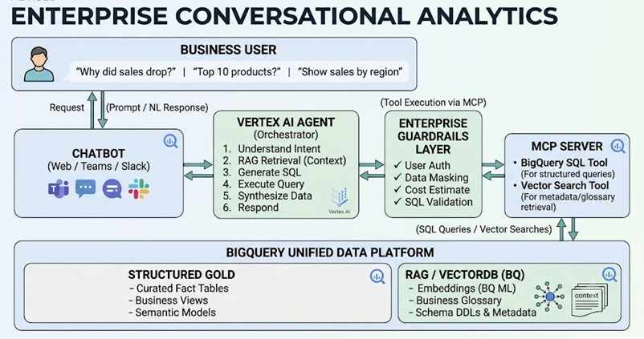

## Enterprise Conversational Analytics with Vertex AI + BigQuery

Building production-ready enterprise conversational analytics means preventing an LLM from querying raw enterprise data directly and instead enforcing a governed, observable pipeline.

### 1. The Orchestration Layer: The Agentic Workflow
A Vertex AI Agent should orchestrate the entire flow instead of sending free-text prompts directly to the warehouse.

- **Intent Understanding:** Determine whether the user wants a data pull, definition, comparison, anomaly explanation, or trend analysis.
- **Context Retrieval (RAG):** Retrieve relevant business context before generating SQL. This includes schema metadata, business glossary definitions, data dictionary text, dbt model descriptions, and metrics definitions.
- **SQL Generation:** Generate SQL only after the Agent has the right context. The query should be drafted against governed semantic models and curated fact tables.
- **Execution & Synthesis:** Execute the query with a safe proxy, then convert the result set into a short, business-friendly explanation.

### 2. The Enterprise Guardrails (The Proxy Layer)
Never let the LLM query BigQuery directly. Place a guardrail proxy between the Vertex AI Agent and the database.

- **User Auth & Data Masking:** Enforce row-level and column-level access controls for the requesting user. The proxy must verify whether the user can access the tables, rows, and sensitive columns implied by the query.
- **Cost Estimation (Dry Runs):** Perform a BigQuery dry-run before actual execution. If the query scans an excessive amount of data or violates cost thresholds, block it and ask the Agent to refine the query.
- **SQL Validation:** Validate SQL to ensure it is read-only and safe. Block DML/DDL like `DROP`, `UPDATE`, `DELETE`, or any unexpected scripting operations.
- **Query Rewriting:** Optionally rewrite queries to use predefined semantic views, materialized views, or curated datasets rather than raw tables.

### 3. Standardized Tooling via MCP
Use an MCP server to standardize the Agent's access to external systems and avoid hardcoded service calls.

- **Vector Search Tool:** A tool that retrieves RAG context from BigQuery-native vector tables or embeddings stores. This is where schema docs, glossary entries, and model metadata are searched.
- **BigQuery SQL Tool:** A tool that submits validated SQL to BigQuery and returns structured results. The proxy should expose this tool with only the safe operations the Agent is allowed to perform.
- **Metadata Tool (optional):** A tool to fetch current dataset schemas, column-level lineage, and metric definitions so the Agent can reason with precise enterprise context.

### 4. The Unified Data Platform: BigQuery for Structured + Vector Data
A strong architecture treats BigQuery as the unified platform for both structured analytics and vector search.

- **Structured Gold Layer:** Curated fact tables, certified semantic models, managed views, and governed data marts live in BigQuery. These are the tables the conversational analytics layer should target.
- **RAG / VectorDB Layer:** Store embeddings in BigQuery using native vector columns or `pgvector`-style support. Keep embeddings for the data dictionary, dbt models, glossary, and KPI definitions alongside structured data.
- **Native Search:** Leverage BigQuery's vector search capabilities so the RAG step stays in the same platform and avoids moving enterprise metadata to a separate vector database.

### Why this is production-ready
This architecture separates reasoning from execution, enforces governance at the proxy layer, and keeps the business context close to the model.

- Business users ask questions in Slack/Teams.
- The Agent reasons with context and drafts SQL.
- Guardrails validate and cost-check the query.
- BigQuery executes the query and returns results.
- The Agent synthesizes an accurate, business-friendly answer.

**Key benefits:** safer query execution, cost control, consistent governance, and a single platform for both analytics data and RAG metadata.
