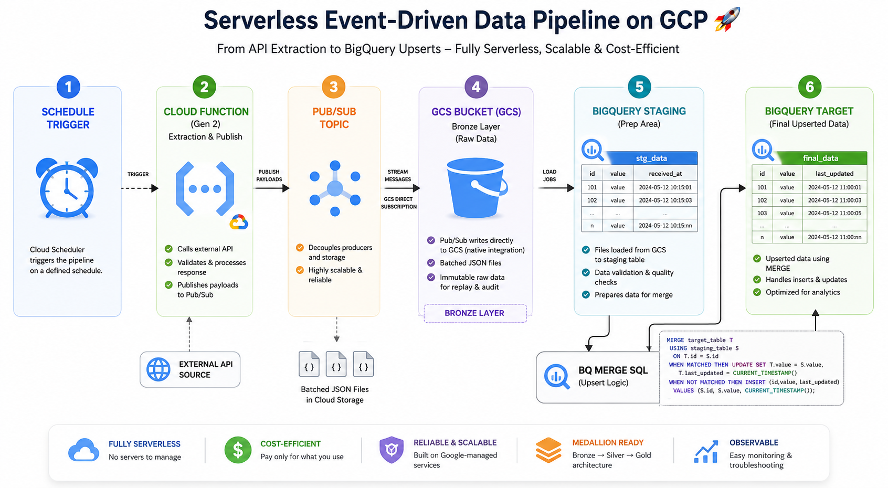

# Fully Serverless Event-Driven API Pipeline on Google Cloud

This example ingests a paginated REST API without Dataflow. It uses managed,
scale-to-zero services for lightweight ETL and keeps an immutable Bronze copy
before incrementally upserting curated records.



## Architecture

```text
Cloud Scheduler -> Cloud Function (Gen2) -> Pub/Sub -> Cloud Storage (Bronze)
                                                        |
                                                        v
BigQuery Silver/Gold <- BigQuery MERGE <- BigQuery Staging
```

- **Cloud Scheduler** securely invokes the function on a cron schedule.
- **Cloud Function Gen2** authenticates to the API, paginates, validates each
  record, adds deterministic event metadata, and publishes it.
- **Pub/Sub** decouples extraction from storage and absorbs traffic bursts.
- **Cloud Storage subscription** writes newline-delimited JSON batches directly
  to an immutable Bronze bucket—no subscriber code or Dataflow job required.
- **BigQuery Data Transfer Service** incrementally loads new Bronze objects into
  staging, where schema and quality checks can run.
- **Scheduled `MERGE`** deduplicates by `record_id` and upserts Silver. Gold
  models can be built over Silver with views, scheduled queries, or Dataform.

The function publishes this stable envelope while preserving the complete API
record in `payload`:

```json
{
  "event_id": "sha256...",
  "record_id": "123",
  "source": "https://api.example.com/v1/orders",
  "ingested_at": "2026-07-03T12:00:00+00:00",
  "payload": {"id": 123, "status": "shipped"}
}
```

## Files

| File | Purpose |
|---|---|
| `main.py` | HTTP Cloud Function: API extraction, validation, and publishing |
| `requirements.txt` | Python runtime dependencies |
| `sql/01_create_tables.sql` | BigQuery staging and Silver tables |
| `sql/02_merge_silver.sql` | Idempotent incremental Silver upsert |
| `pubsub.png` | Architecture diagram |

## Prerequisites

- A Google Cloud project with billing enabled
- `gcloud` and `bq` authenticated to that project
- A globally unique Bronze bucket name
- An API whose records contain `id` or `record_id`

The sample defaults to JSONPlaceholder, so it can be deployed without an API
token. For production, set `API_URL` and store the bearer token in Secret
Manager.

## 1. Set variables and enable APIs

Run from this directory in Cloud Shell or Bash:

```bash
export PROJECT_ID="your-project-id"
export REGION="us-central1"
export BUCKET="${PROJECT_ID}-api-bronze"
export FUNCTION_SA="api-ingestor@${PROJECT_ID}.iam.gserviceaccount.com"
export SCHEDULER_SA="api-scheduler@${PROJECT_ID}.iam.gserviceaccount.com"
gcloud config set project "${PROJECT_ID}"

gcloud services enable \
  artifactregistry.googleapis.com \
  bigquery.googleapis.com \
  bigquerydatatransfer.googleapis.com \
  cloudbuild.googleapis.com \
  cloudfunctions.googleapis.com \
  cloudscheduler.googleapis.com \
  eventarc.googleapis.com \
  pubsub.googleapis.com \
  run.googleapis.com \
  secretmanager.googleapis.com \
  storage.googleapis.com
```

## 2. Create identities, topic, and Bronze storage

```bash
gcloud iam service-accounts create api-ingestor \
  --display-name="API ingestion function"
gcloud iam service-accounts create api-scheduler \
  --display-name="API ingestion scheduler"

gcloud pubsub topics create api-events
gcloud storage buckets create "gs://${BUCKET}" \
  --location="${REGION}" --uniform-bucket-level-access
gcloud storage buckets update "gs://${BUCKET}" --versioning

gcloud projects add-iam-policy-binding "${PROJECT_ID}" \
  --member="serviceAccount:${FUNCTION_SA}" \
  --role="roles/pubsub.publisher"
```

Pub/Sub's service agent needs permission to write objects. Create the direct
Cloud Storage subscription in text mode; each Pub/Sub message becomes one JSON
line in a batched `.jsonl` file.

```bash
PROJECT_NUMBER=$(gcloud projects describe "${PROJECT_ID}" \
  --format='value(projectNumber)')
PUBSUB_AGENT="service-${PROJECT_NUMBER}@gcp-sa-pubsub.iam.gserviceaccount.com"

gcloud storage buckets add-iam-policy-binding "gs://${BUCKET}" \
  --member="serviceAccount:${PUBSUB_AGENT}" \
  --role="roles/storage.objectCreator"

gcloud pubsub subscriptions create api-events-to-bronze \
  --topic=api-events \
  --cloud-storage-bucket="${BUCKET}" \
  --cloud-storage-file-prefix="api_events/" \
  --cloud-storage-file-suffix=".jsonl" \
  --cloud-storage-file-datetime-format="YYYY/MM/DD/hh_mm_ssZ" \
  --cloud-storage-max-duration=5m \
  --cloud-storage-max-bytes=100MB \
  --cloud-storage-output-format=text
```

## 3. Optional API bearer token

```bash
printf '%s' 'replace-with-token' | \
  gcloud secrets create external-api-token --data-file=-
gcloud secrets add-iam-policy-binding external-api-token \
  --member="serviceAccount:${FUNCTION_SA}" \
  --role="roles/secretmanager.secretAccessor"
```

Do not set `API_SECRET_NAME` at deployment if the API requires no token.

## 4. Deploy and schedule the function

```bash
gcloud functions deploy ingest-api \
  --gen2 \
  --runtime=python312 \
  --region="${REGION}" \
  --source=. \
  --entry-point=ingest_api \
  --trigger-http \
  --no-allow-unauthenticated \
  --service-account="${FUNCTION_SA}" \
  --memory=512Mi \
  --timeout=540s \
  --set-env-vars="PUBSUB_TOPIC=api-events,API_URL=https://jsonplaceholder.typicode.com/posts,PAGE_SIZE=100,MAX_PAGES=100,PAGE_PARAM=_page,LIMIT_PARAM=_limit"

FUNCTION_URL=$(gcloud functions describe ingest-api --gen2 \
  --region="${REGION}" --format='value(serviceConfig.uri)')

gcloud run services add-iam-policy-binding ingest-api \
  --region="${REGION}" \
  --member="serviceAccount:${SCHEDULER_SA}" \
  --role="roles/run.invoker"

gcloud scheduler jobs create http ingest-api-hourly \
  --location="${REGION}" \
  --schedule="0 * * * *" \
  --uri="${FUNCTION_URL}" \
  --http-method=POST \
  --headers="Content-Type=application/json" \
  --message-body='{"start_page":1}' \
  --oidc-service-account-email="${SCHEDULER_SA}" \
  --oidc-token-audience="${FUNCTION_URL}"
```

For a secured API, add `API_SECRET_NAME=external-api-token` to
`--set-env-vars`. Adapt the pagination parameter names in `main.py` when an API
uses cursors. For different page/limit names, set `PAGE_PARAM` and
`LIMIT_PARAM` without changing the code.

## 5. Create BigQuery tables

The SQL files use placeholders so the same source is portable across projects:

```bash
sed -e "s/\${PROJECT_ID}/${PROJECT_ID}/g" \
    -e "s/\${REGION}/${REGION}/g" sql/01_create_tables.sql | bq query \
    --use_legacy_sql=false --location="${REGION}"
```

## 6. Load Bronze into staging

In **BigQuery > Data transfers > Create transfer**, choose **Google Cloud
Storage** and configure:

- Source: `gs://YOUR_BUCKET/api_events/*.jsonl`
- Destination table: `api_events_staging`
- File format: `NEWLINE_DELIMITED_JSON`
- Write preference: `APPEND`
- Schedule: hourly (after the Pub/Sub batch window)
- Enable deletion of source files: **off**

BigQuery Data Transfer Service tracks previously loaded files for recurring
Cloud Storage transfers. Keep the source object names unique and do not modify
objects after creation.

## 7. Schedule the Silver MERGE

Replace `${PROJECT_ID}` in `sql/02_merge_silver.sql`, run it once, then save it
as an hourly BigQuery scheduled query. Give its service account BigQuery Job
User on the project and BigQuery Data Editor on the `api_pipeline` dataset.

```bash
sed "s/\${PROJECT_ID}/${PROJECT_ID}/g" sql/02_merge_silver.sql | bq query \
  --use_legacy_sql=false --location="${REGION}"
```

The deterministic `event_id` makes retries harmless. The `MERGE` only updates a
record when its payload changes and scans the latest two staging partitions.

## Test and monitor

```bash
gcloud scheduler jobs run ingest-api-hourly --location="${REGION}"
gcloud functions logs read ingest-api --gen2 --region="${REGION}" --limit=50
gcloud storage ls "gs://${BUCKET}/api_events/**"
bq query --use_legacy_sql=false \
  "SELECT COUNT(*) FROM \`${PROJECT_ID}.api_pipeline.api_records_silver\`"
```

Useful alerts include function error count, Pub/Sub oldest unacked message age,
transfer failures, and scheduled-query failures. Add a dead-letter topic when
the source system requires explicit poison-message handling.

## Why not Dataflow here?

This design is a good fit for scheduled REST extraction, modest per-record
transformations, and straightforward upserts. Prefer Dataflow when you need
high-throughput continuous streaming, event-time windows, stream joins,
stateful processing, complex Apache Beam transforms, or very large ETL jobs.

The architectural win is restraint: use the smallest managed service that
matches each part of the workload.
