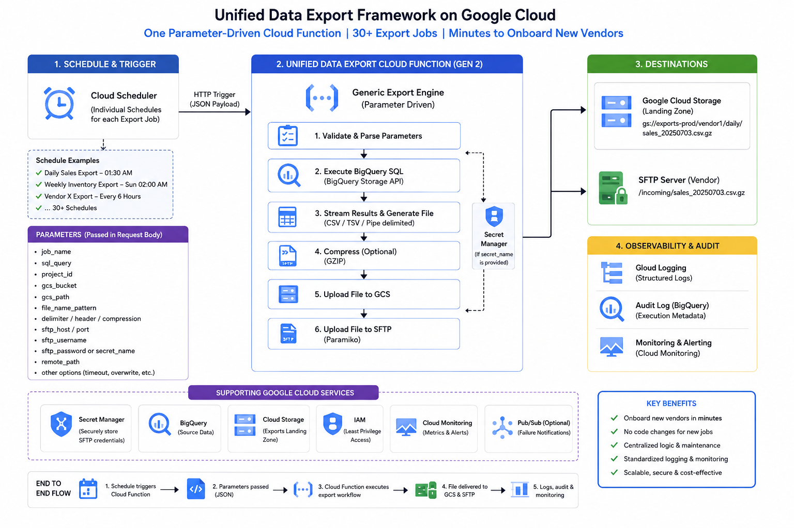

# Unified Data Export Framework

A production-oriented Python 3.12 Google Cloud Functions Gen2 framework for
scheduled BigQuery exports to Cloud Storage and SFTP. It streams BigQuery
Storage API Arrow batches into a local delimited file, so memory use is bounded
by batch size rather than total result size.

## Architecture



## Documentation

- [Architecture and production decisions](docs/architecture.md)
- [Request contract and module reference](docs/modules-and-api.md)
- [Deployment and Cloud Scheduler setup](docs/deployment.md)
- [Local tests, Postman, and operations](docs/testing-and-operations.md)

## Quick start

```powershell
cd unified-data-export-framework
py -3.12 -m venv .venv
.\.venv\Scripts\Activate.ps1
python -m pip install -r requirements-dev.txt
pytest -q
functions-framework --target unified_data_export --debug
```

Production requests should use `sftp_secret` or
`sftp_private_key_secret`. Direct `sftp_password` input exists only for
backward compatibility and is rejected unless
`ALLOW_INLINE_SFTP_PASSWORD=true` is deliberately configured.
